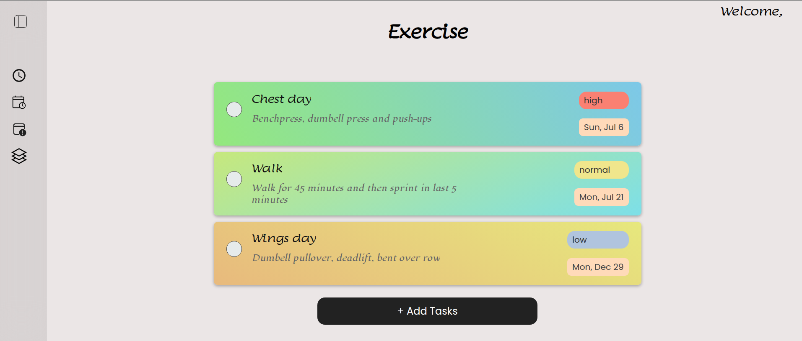
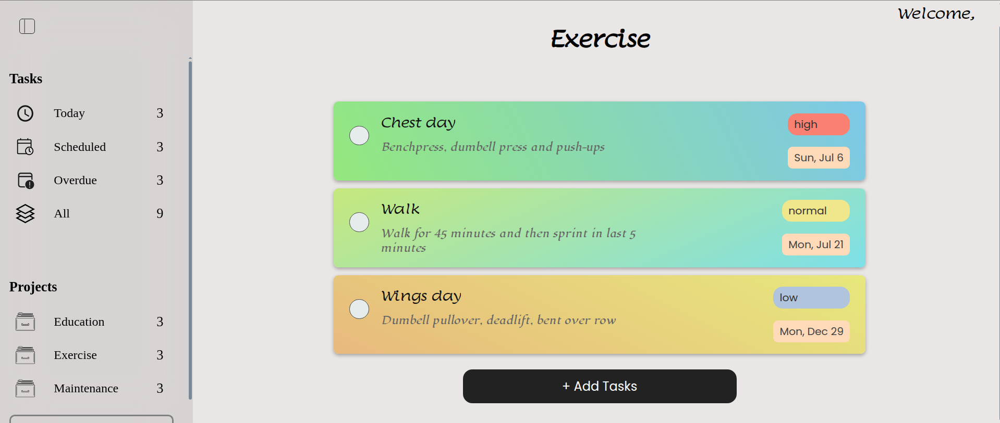
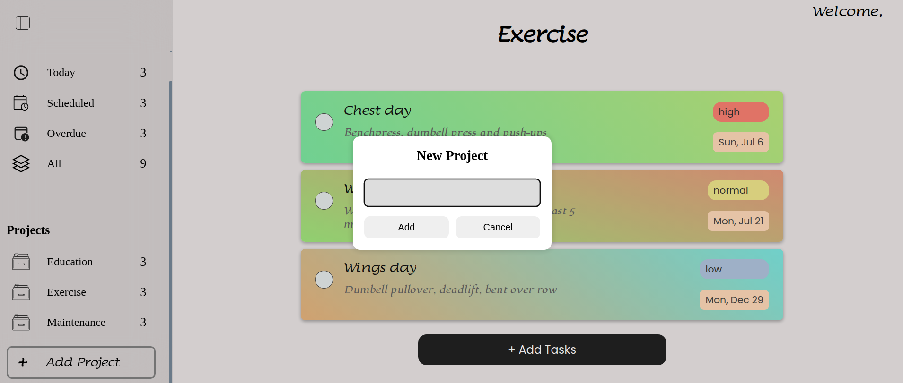
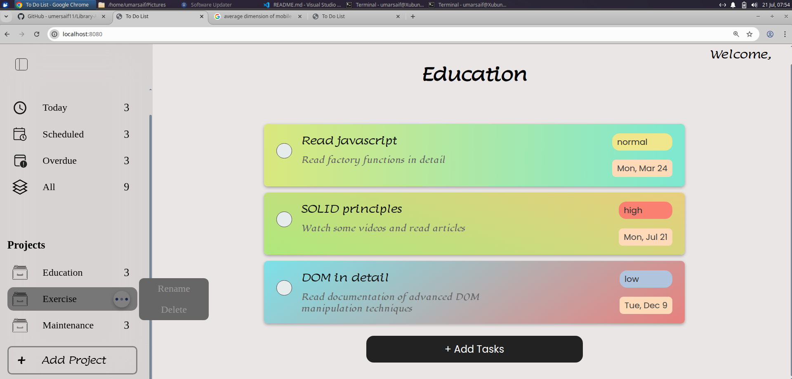
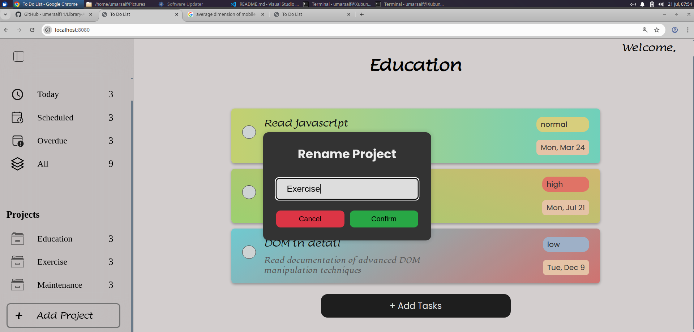
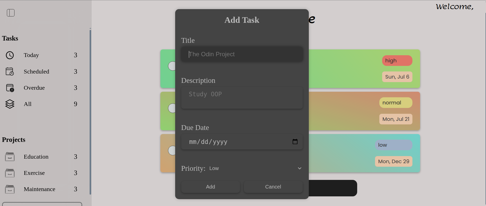
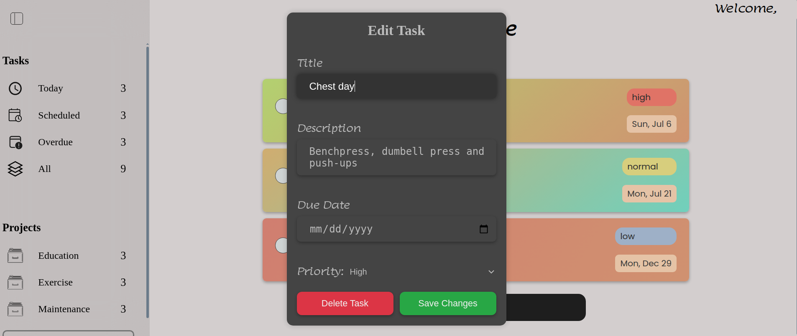
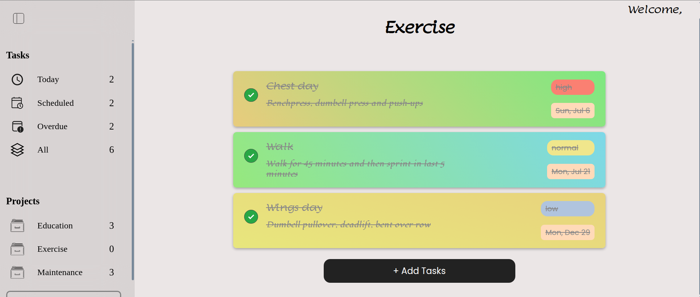
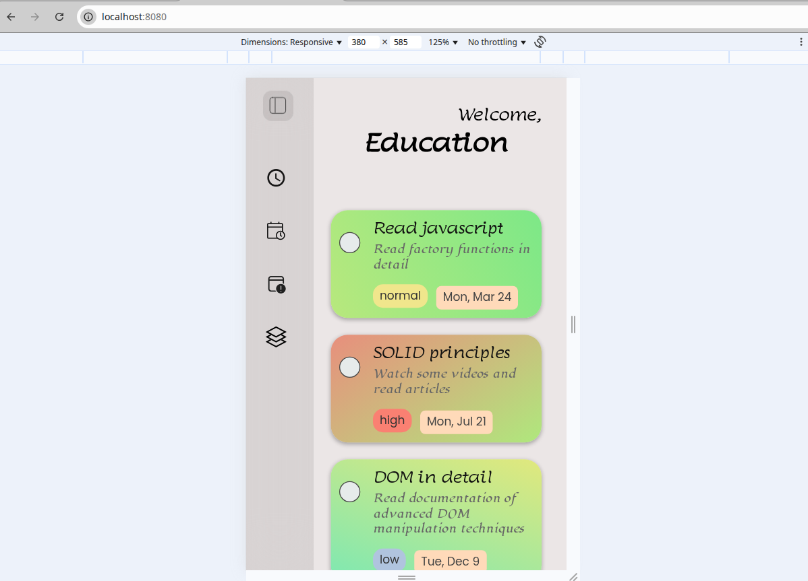
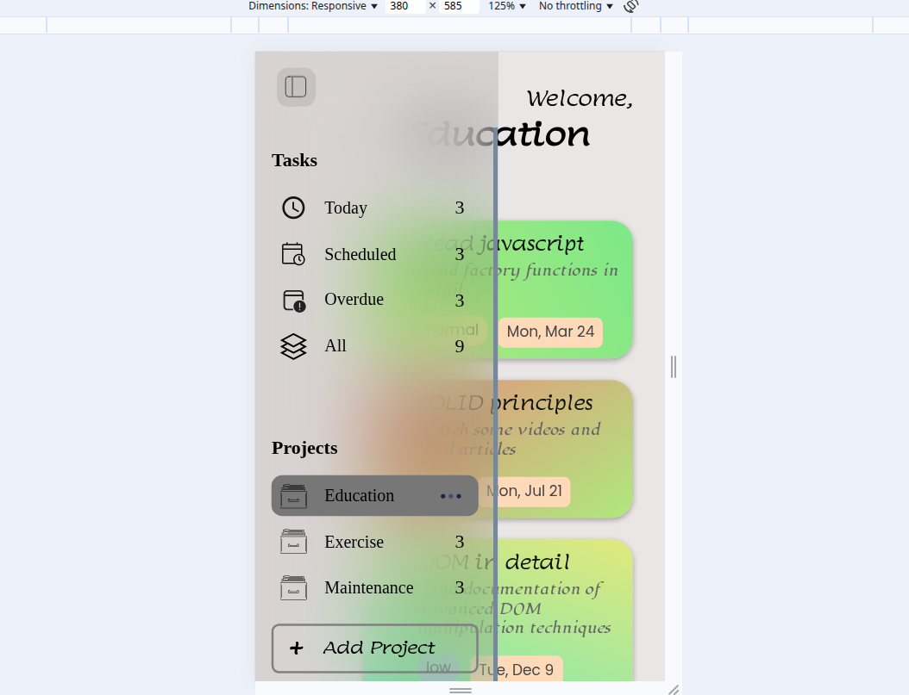

# 📝 To-Do List Application
[](https://umersaif11.github.io/to-do-list/)

## 💻 Tech Stack:

- JavaScript ES6+
- HTML5
- CSS3
- npm
- Webpack - Build tool
- date-fns - Library
- ESLint - Linter
- Prettier - Code Formatter
- localStorage API

---

## 🔍 Key Concepts Demonstrated

### Software Architecture: 
Clean separation of concerns (Logic vs. UI) and a central controller (index.js).
### State Management:
A master refreshUI() function ensures the UI is always a perfect reflection of the application's state.
### Data Persistence: 
Full CRUD (Create, Read, Update, Delete) functionality for both projects and tasks, with all data saved to localStorage.
### Advanced JavaScript:
Effective use of the Module Pattern, closures, and object destructuring. 
### Robust UI Handling: 
Dynamic DOM creation and manipulation, event delegation to handle complex user interactions, and custom pop-up modals and menus.
### Responsive Design: 
A collapsible sidebar and CSS media queries ensure a seamless experience on both desktop and mobile devices.

---

## 🎨 Key Features:

- Clean, intuitive UI
- Collapsible side-bar
- Add project in side bar
- Add Task in project from 'Add task'
- Edit projects by clicking or hovering on project and then click three dot button and then click 'rename'
- Edit todos by clicking on task card
- Delete task by clicking on task and then clicking delete task button
-Delete projects by clicking or hovering on project and then click three dot button and then click 'delete'
- 'Priority' pills color(red for high, yellow for normal,blue for low) coupled with text notation to ensure that user can clearly see todo priorities
- 'Date' pills mentioning day and month
- Filters for todos based on specific criteria (today's , scheduled date, overdue, all todos)
- Use of localStorage to recall todos/projects in order upon reloading the page
- Make task complete by clicking checkbox
- Strikethrough line for todos marked "Complete"
-Responsive design for mobile and tablets
---
## 🗣️ Description

This project is a complete, feature-rich to-do list application built from the ground up using vanilla JavaScript (ES6+), HTML5, and CSS3. It demonstrates a solid understanding of modern front-end architecture without relying on any frameworks.

The application is structured with a clean separation of concerns, featuring a dedicated logic module for data management and a UI module for rendering. All user data is saved to the browser's localStorage, ensuring persistence between sessions. The project is bundled for production using Webpack and includes a fully interactive and responsive user interface.

---

## ⛰️ Challenges Faced & Lessons Learned
### Application Logic(``` app-logic.js ```):
1) #### Data Structure
How tasks would be stored in projects? And how should projects be stored? After experimenting and failing, came up with a structure where projects will be stored as objects in a array and tasks will be added as objects in an array where array is the value of specific project's object property("todos")

2) #### Necessity of local storage
While tried to edit task, i faced a problem that everytime i tried to access a task's crypto id it kept changing everytime, So the need for local storage came so that task can saved with its one id and so i can access it later
3) #### Designing a Flexible Update AP
The initial editToDo function was rigid, requiring all properties to be passed in. To support partial updates (e.g., changing only the title), the function was refactored to accept an "options object," utilizing ES6 destructuring in the parameters to create a flexible and clean API

### In the controller(``` index.js ```):

1) #### Centralized UI Rendering
Initial attempts to update the DOM from various places led to a disorganized UI. This was solved by creating a single, master refreshUI() function. This function acts as the central rendering engine, ensuring the entire UI is consistently redrawn from the single source of truth whenever the application's state changes.

2) #### Efficient Event Handling via Delegation
Instead of adding potentially hundreds of event listeners to individual, dynamically created items, the more performant Event Delegation pattern was used. Listeners were attached only to parent containers (#projects-list, #task-list), simplifying the code and improving performance.

3) #### Managing Multiple Event Targets
A single delegated listener had to handle various actions (selecting a project, opening an options menu, editing a task, toggling completion). This was solved by using conditional logic with .closest() and .classList.contains() on the event.target to precisely identify what the user clicked and trigger the correct response.

4) #### UI State Management
THe tasks of specific projects are getting display from 'projectsArray' in app-logic.js using displayTasks() in app-ui.js and filtered tasks are getting display using getTodayTasks(), getScheduleTasks() etc function from logi.js using displayTasks() in app-ui.js, So refreshUI() had to be modified for separate views. 

The application would forget which view the user was in (e.g., "Today" vs. a specific project) after an update. This was solved by implementing a stateVariable to track the currentView, making the refreshUI() function "smart" enough to always re-render the correct view after any action.

5) #### Modal Interaction Logic
All logic for managing the application's dialogs was centralized in the controller. This included opening modals in response to user clicks, wiring up "Cancel" buttons, and handling form submission events to gather user input, call the logic module with that data, and then close the modal.

6) #### Dynamic Element Positioning 
The pop-up menu needed to appear next to the specific icon that was clicked. This was solved by using the event object and the getBoundingClientRect() method to calculate the icon's exact coordinates on the page and then dynamically applying top and left styles to the newly created menu.

7) #### Input Data Sanitization
 To prevent timezone bugs, the raw date string from the <input type="date"> is not passed directly to the logic layer. Instead, the controller is responsible for parsing this string (YYYY-MM-DD), creating a reliable Date object, and then passing that pure object to the logic module 

### User Interface(``` app-ui.js ```):

1) #### Dynamic and Conditional Rendering
The UI had to correctly render different states. For example, a displayTasks function was created to render lists of tasks, and it was later enhanced to add a .completed class based on the task's data, ensuring the view is always a direct reflection of the state.

2) #### Modular Rendering
The initial impulse to have UI functions fetch their own data was refactored into a cleaner pattern. UI functions like renderProjects were designed to be "dumb," simply accepting data as an argument and rendering it, which improved the separation of concerns.

---

## 🖥️ Screenshots

Main UI with collapsed sidebar


Main UI with open sidebar


Add Project


Rename/Delete Project Popup


Rename Project


Add Task


Edit and Delete Task


Checked Task


Mobile View with collapsed sidebar


Mobile View with open sidebar


---

## 🏃📜 Run This Project Locally

#### 1. Clone Repo

```
git clone https://github.com/umersaif11/to-do-list.git
```

#### 2. CD into project folder

```
cd to-do-list
```

#### 3. Install dependencies from package.json

```
npm install
```

#### 4. Start development server:

```
npm run start
```

#### 5. Visit local web server in your browser to view:

```
localhost:8080
```
